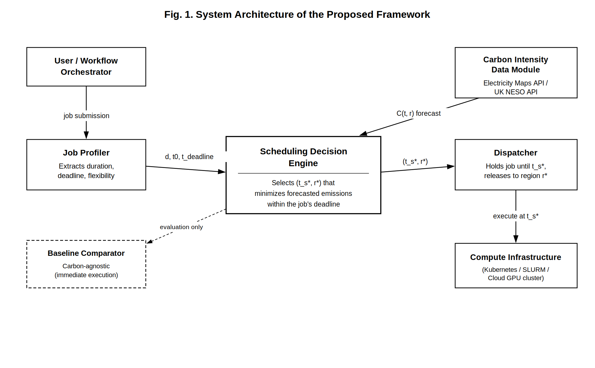

# Carbon-Aware AI Model Scheduling

A deadline-aware scheduling framework that shifts AI training and inference
jobs to lower-carbon times and regions, without changing the model or hardware.

## Key results
| Experiment | Result |
|---|---|
| 400 temporal trials (Great Britain, 21 days, 1,009 readings) | 29.00% mean emissions reduction |
| Range across flexibility levels | 21.08% (short window) to 32.86% (24 h deadline) |
| Weighted mean added delay | 7.95 hours |
| With realistic forecast error (MAE 17.25 gCO2/kWh) | 24.47% (vs 29.73% perfect foresight) |
| Versus bounded-window Flexible Start baseline | 29.00% vs 13.26% |
| Spatial relocation across 8 regions (48 h window) | 83.66% mean reduction |

## Project structure
- `src/`: scheduler, baseline, dispatcher, carbon data and job profiler
- `app.py`: interactive demo (sliders for duration, deadline, power, submission time)
- `experiments/`, `run_uk_neso_multitrial.py`: experiment runners
- `forecast_sensitivity.py`, `compare_against_flexible_start.py`: sensitivity and baseline comparison
- `results/`: output CSVs
- `data/`: sample and processed carbon-intensity data
- `paper/`: research paper

## Run it
    pip install -r requirements.txt
    streamlit run app.py

## Fetching fresh data
Data comes from the Electricity Maps API. Set your own key (never commit it):

    set ELECTRICITYMAPS_API_KEY=your_key_here
    python pull_full_dataset.py

The raw Electricity Maps files are not included in this repo.